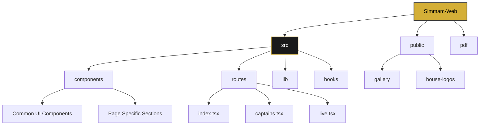

# 🦁 SIMMAM 2026 — The Legacy Continues

Welcome to the official repository of **SIMMAM 2026**, a premium web experience for the grand inter-house cultural and sports festival.

[SIMMAM}(https://github.com/ssesimmam/Simmam-Web/blob/264882c11dad4e96ad54458de1ac860e5f7c1b62/src/assets/simmam-lion.png)

---

## 🚀 Tech Stack

This project is built with a modern, high-performance stack designed for speed, aesthetics, and developer experience.

### **Core Frameworks**
- 
- 
- 
- 

### **Styling & UI**
- 
- 
- 
- 

### **State & Routing**
- 
- 

---

## 🛠 Project Structure



### Key Directories:
- `src/components`: Reusable UI components (Navbar, Footer, Glassmorphic cards).
- `src/routes`: Application pages managed by TanStack Router.
- `src/lib`: Shared utilities, types, and house data constants.
- `public/`: Static assets including high-resolution house crests and gallery images.

---

## 💎 The Elite Crew — Web Development Team

The digital manifestation of SIMMAM 2026 is brought to life by this dedicated team of developers and architects.

| Name | Role | Contact |
| :--- | :--- | :--- |
| **Sasvanthu G** | 👑 Team Lead | [+91 86108 73714](tel:+918610873714) |
| **Moniga V** | 🏗 Technical Architect | [+91 63791 92435](tel:+916379192435) |
| **Roshini R** | 📊 Product Analyst | [+91 86105 99005](tel:+918610599005) |
| **Suvedhan G** | 💻 Full-Stack Developer | [+91 90422 98646](tel:+919042298646) |
| **Sudharsan R K** | 🛠 Software Developer | [+91 63799 96328](tel:+916379996328) |

### Support Team
- **Deepa preya H**
- **Swetha C**

---

## ✨ Features

- **3D Interactive Elements**: Powered by custom Tilt3D components for a premium feel.
- **Glassmorphic UI**: Modern aesthetic using backdrop blurs and subtle gradients.
- **Real-time Scoring Dashboard**: Visualized house standings with dynamic progress bars.
- **Responsive Gallery**: Optimized image mosaic showing the legacy of past years.
- **Performance Optimized**: Leveraging Vite and TanStack Start for lightning-fast loads.

---

## 🛠 Getting Started

1. **Install Dependencies**:
   ```bash
   bun install
   # or
   npm install
   ```

2. **Run Development Server**:
   ```bash
   npm run dev
   ```

3. **Build for Production**:
   ```bash
   npm run build
   ```

---

## 📜 License

**© 2026 SIMMAM. All Rights Reserved.**
This project is proprietary and built exclusively for the SIMMAM 2026 event. Unauthorized distribution or reproduction is prohibited.

---

<p align="center">
  Built with ❤️ by the SIMMAM Web Team
</p>
